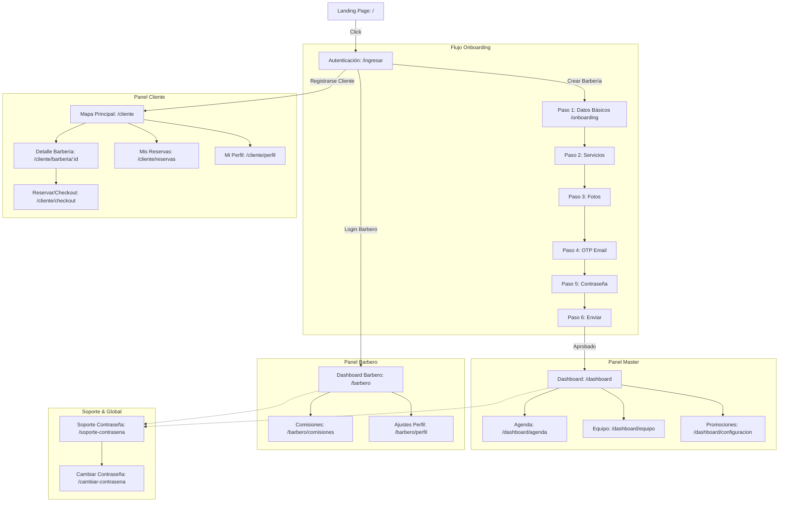

# MAPA DE NAVEGACIÓN - SITE MAP (FASE 4)

Este documento detalla la jerarquía de URLs y pantallas para complementar la arquitectura de navegación de **StylerNow**.

---

## 🧭 1. Estructura de Rutas (Sitemap)

### 🔄 Diagrama de Conectividad de Pantallas

---

## 🔐 2. Árbol de Accesos por Rol

- **Master / Admin**: `/dashboard`, `/dashboard/agenda`, `/dashboard/equipo`, `/dashboard/configuracion`
- **Barbero/Colaborador**: `/barbero`, `/barbero/comisiones`, `/barbero/perfil`
- **Cliente / Invitado**: `/`, `/cliente`, `/cliente/barberia/[id]`, `/cliente/checkout`, `/cliente/reservas`
- **SuperAdmin**: `/admin` (Gestión de Banners, Reset Contraseñas)

---

*Diseñado por la Dirección de UX/UI - Wilbot Ultra*
