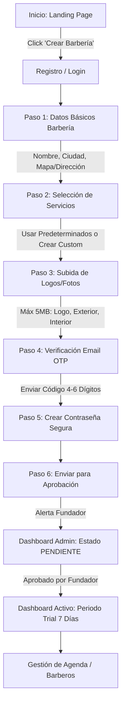
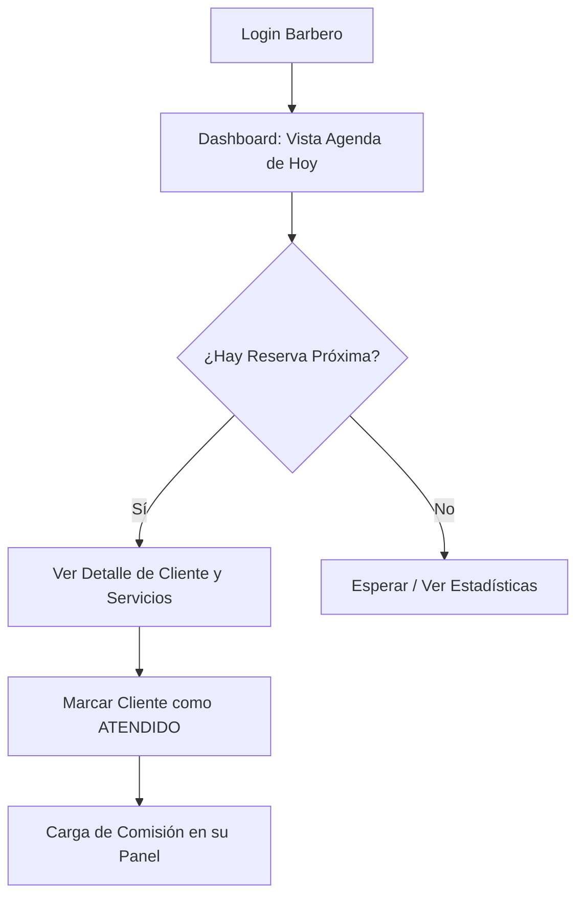
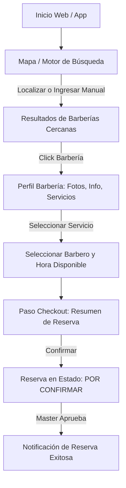

# FLUJOS DE USUARIO - UX ARCHITECTURE

Este documento describe la navegación y lógica de interacción para cada rol en **StylerNow**.

---

## 👑 1. Flujo del Rol: Master (Dueño de Barbería)

El flujo del Master se enfoca en el **Onboarding** y la **Administración**.

### 🔄 Diagrama de Flujo: Onboarding & Dashboard

---

## 💈 2. Flujo del Rol: Barbero (Empleado)

El flujo del Barbero está optimizado para dispositivos móviles (Mobile First).

### 🔄 Diagrama de Flujo: Gestión de Turnos

---

## 🙋‍♂️ 3. Flujo del Rol: Cliente (Usuario Final)

El flujo del cliente está enfocado en la búsqueda rápida y la reserva interactiva.

### 🔄 Diagrama de Flujo: Búsqueda y Reserva

---

*Diseñado por la Dirección de UX/UI - Wilbot Ultra*
